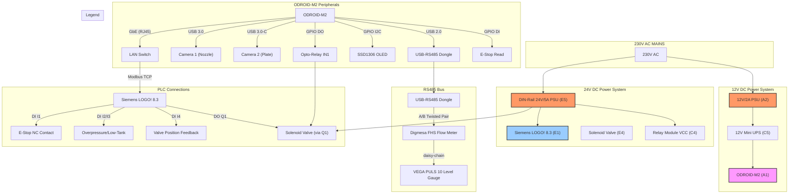

# System-Level Block Diagram

This diagram shows the high-level interconnection of all major components in the system, from power sources to the ODROID-M2, PLC, and peripherals.

```mermaid
graph TD
    subgraph "230V AC MAINS"
        A[230V AC]
    end

    subgraph "24V DC Power System"
        PSU_24V["DIN-Rail 24V/5A PSU (E5)"]
        PLC["Siemens LOGO! 8.3 (E1)"]
        VALVE["Solenoid Valve (E4)"]
        RELAY_COIL["Relay Module VCC (C4)"]
    end

    subgraph "12V DC Power System"
        PSU_12V["12V/2A PSU (A2)"]
        UPS["12V Mini UPS (C5)"]
        M2["ODROID-M2 (A1)"]
    end

    subgraph "ODROID-M2 Peripherals"
        direction LR
        M2_Board["ODROID-M2"]
        LAN["LAN Switch"]
        CAM1["Camera 1 (Nozzle)"]
        CAM2["Camera 2 (Plate)"]
        RS485_DONGLE["USB-RS485 Dongle"]
        OLED["SSD1306 OLED"]
        RELAY_IN["Opto-Relay IN1"]
        ESTOP_IN["E-Stop Read"]
    end

    subgraph "RS485 Bus"
        direction TB
        RS485_DONGLE_2["USB-RS485 Dongle"] -->|A/B Twisted Pair| FHS["Digmesa FHS Flow Meter"]
        FHS -->|daisy-chain| VEGA["VEGA PULS 10 Level Gauge"]
    end
    
    subgraph "PLC Connections"
        direction TB
        PLC_2["Siemens LOGO! 8.3"]
        ESTOP_PLC["E-Stop NC Contact"]
        ALARM_PLC["Overpressure/Low-Tank"]
        VALVE_FEEDBACK["Valve Position Feedback"]
        SOLENOID_RELAY["Solenoid Valve (via Q1)"]
    end

    A --> PSU_24V
    A --> PSU_12V

    PSU_24V --> PLC
    PSU_24V --> RELAY_COIL
    PSU_24V --> SOLENOID_RELAY

    PSU_12V --> UPS --> M2

    M2_Board -- "GbE (RJ45)" --> LAN
    M2_Board -- "USB 3.0" --> CAM1
    M2_Board -- "USB 3.0-C" --> CAM2
    M2_Board -- "USB 2.0" --> RS485_DONGLE
    M2_Board -- "GPIO I2C" --> OLED
    M2_Board -- "GPIO DO" --> RELAY_IN
    M2_Board -- "GPIO DI" --> ESTOP_IN
    
    LAN -- "Modbus TCP" --> PLC_2

    RS485_DONGLE --> RS485_DONGLE_2

    PLC_2 -- "DI I1" --> ESTOP_PLC
    PLC_2 -- "DI I2/I3" --> ALARM_PLC
    PLC_2 -- "DI I4" --> VALVE_FEEDBACK
    PLC_2 -- "DO Q1" --> SOLENOID_RELAY
    RELAY_IN --> SOLENOID_RELAY
    
    subgraph "Legend"
        direction LR
        style M2 fill:#f9f,stroke:#333,stroke-width:2px
        style PLC fill:#9cf,stroke:#333,stroke-width:2px
        style PSU_24V fill:#f96,stroke:#333,stroke-width:2px
        style PSU_12V fill:#f96,stroke:#333,stroke-width:2px
    end
```
