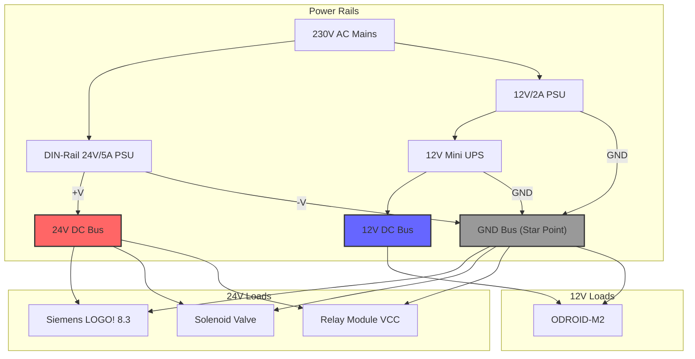

# Power Distribution Diagram

This diagram focuses on how the 24V and 12V rails are generated from the mains supply and distributed to the various loads. It also highlights the critical "star ground" bus point.

