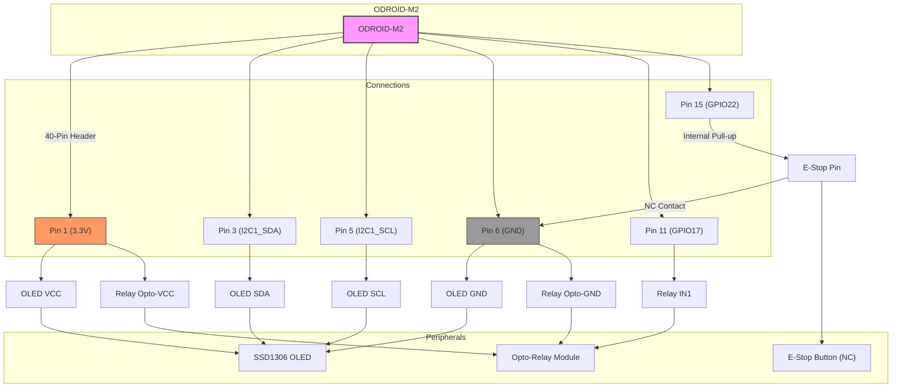

# ODROID-M2 GPIO Wiring Diagram

This diagram shows the specific connections from the ODROID-M2's 40-pin GPIO header to the low-voltage peripherals like the OLED display, relay module logic side, and E-Stop button.

