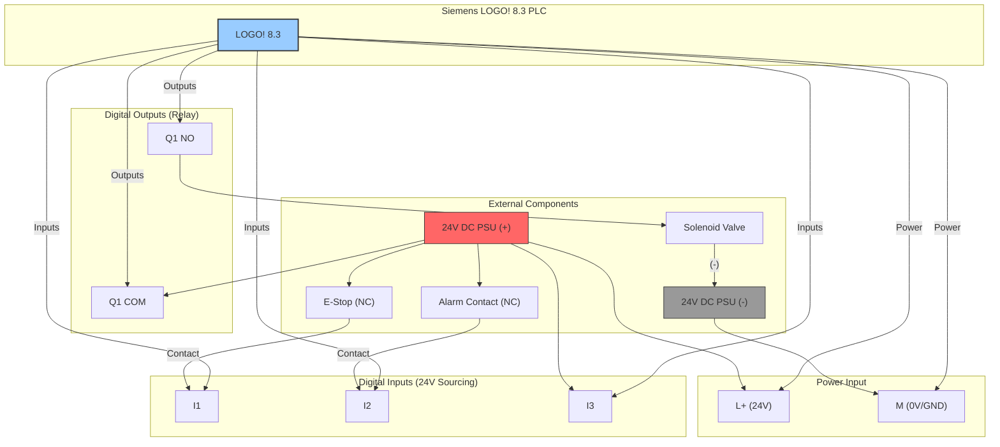

# Siemens LOGO! 8.3 PLC Wiring Diagram

This diagram details the connections to the Siemens LOGO! PLC, including its 24V power, the safety-critical digital inputs (like the E-Stop), and the high-power relay output controlling the solenoid valve.

