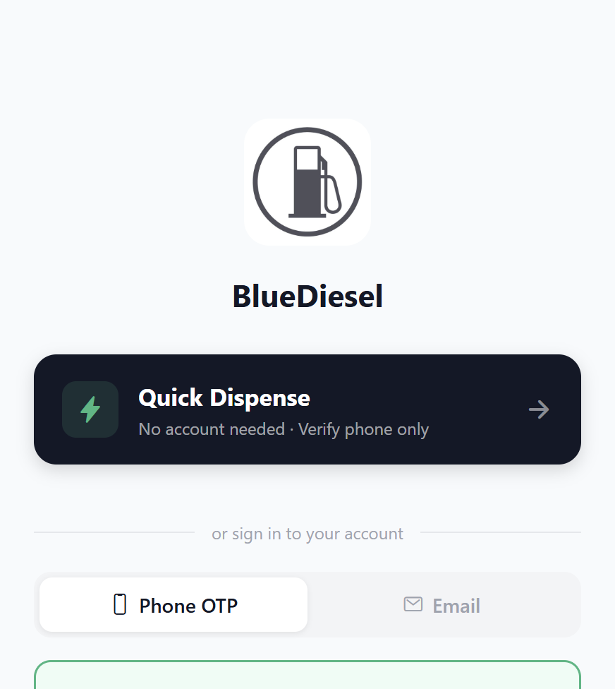
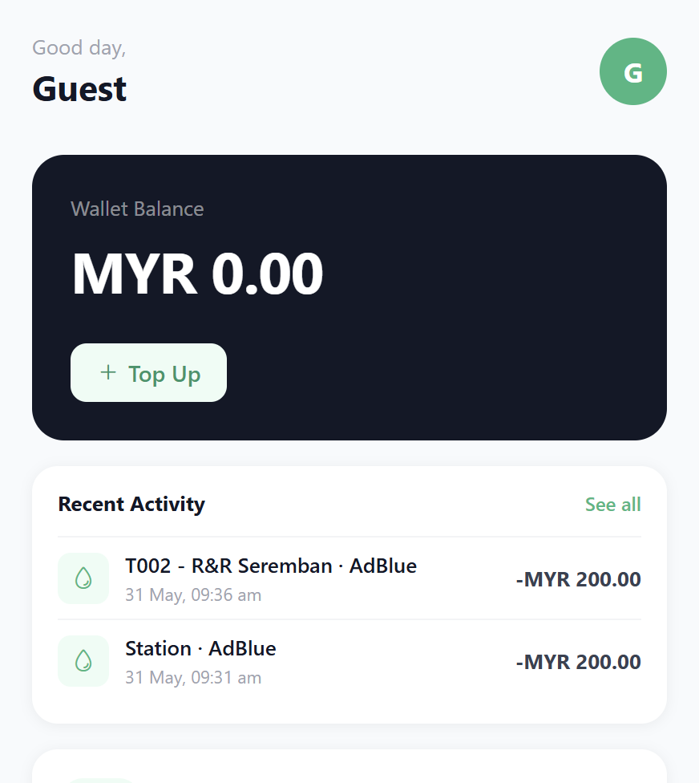
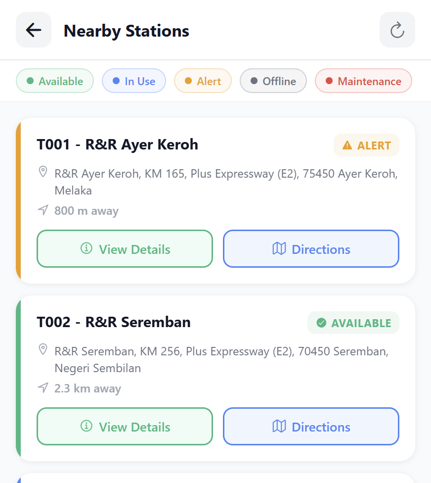
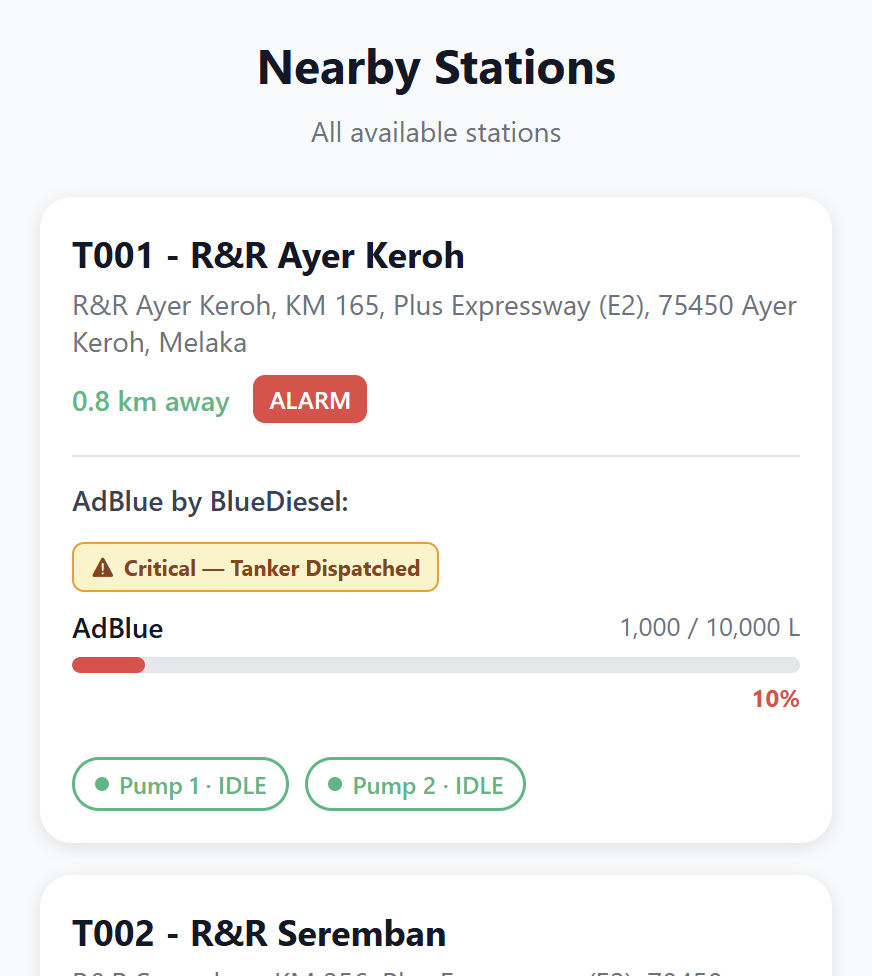
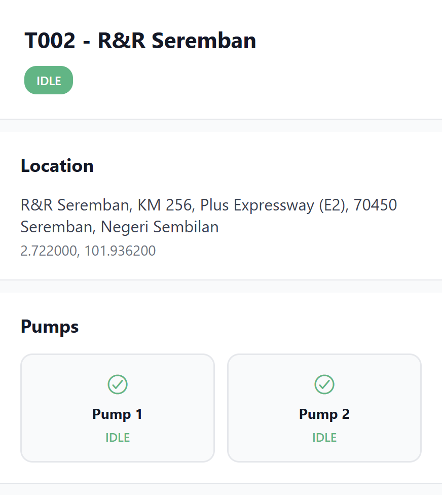
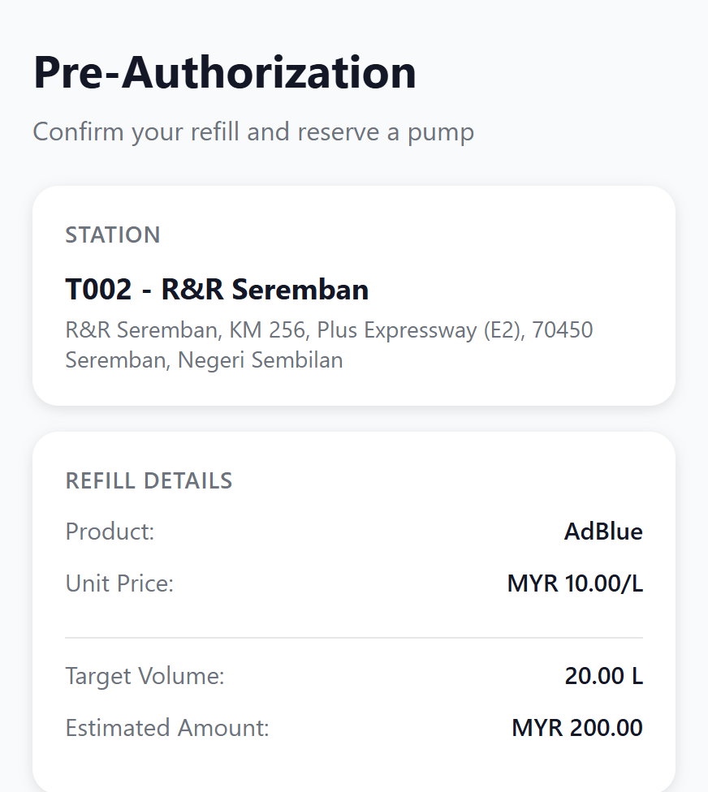
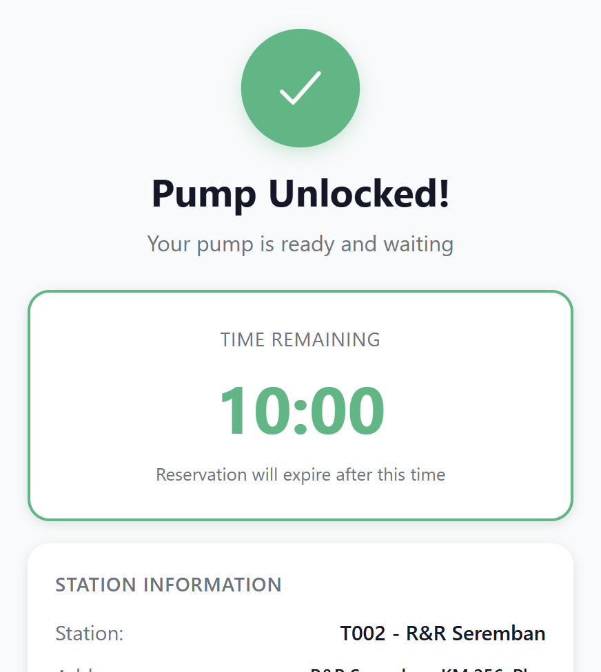
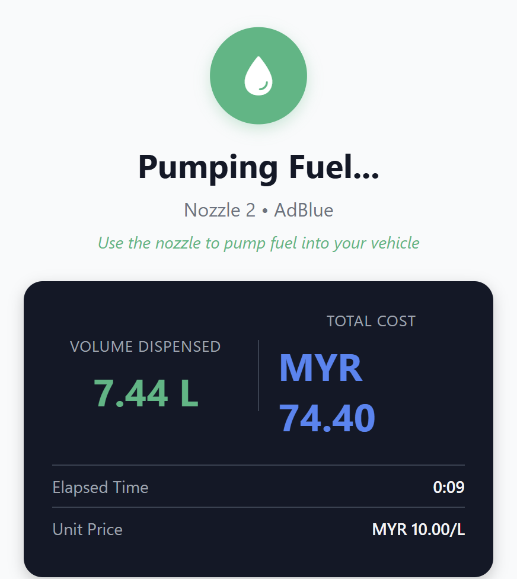

# App User Journey Report

Last updated: May 31, 2026

## Scope

This report is written for Fiuu to explain the BlueDiesel app user journey, identify where payment appears in that journey, and clarify how Fiuu is expected to operate as the backend payment platform.

The report is based on the live web build running at `http://localhost:8081` at the time of capture.

The screenshots in this report were generated from the current interface and saved in the same folder as this report.

## Executive Summary

The app already presents a coherent self-service refill flow for a BlueDiesel AdBlue dispensing use case:

1. user lands on the login screen;
2. user enters the refill experience from the home dashboard;
3. user locates a station and reviews station details;
4. user proceeds through pre-authorization and pump unlock;
5. user reaches the live dispensing screen with wallet hold visibility.

For Fiuu review, the key point is that BlueDiesel intends to use Fiuu as the backend payment platform behind the app's wallet and transaction flow. At the user-facing level, the BlueDiesel e-wallet still needs to let users choose familiar payment channels such as credit card, Touch 'n Go eWallet, online banking, and other supported digital payment options routed through Fiuu.

At present, parts of the refill flow still use simulated wallet-hold behavior. The largest immediate blocker in the web build is the authentication path. On web, login currently throws an `expo-secure-store` error, so the report below uses route-rendered screens and demo fallback data rather than a successful authenticated session.

## Fiuu Relevance

This app is relevant to Fiuu because payment is not a standalone checkout step. Fiuu sits behind a controlled dispensing workflow where payment state directly affects whether a pump can be unlocked and how much product can be dispensed.

BlueDiesel's intended customer experience is:

- users interact with a BlueDiesel wallet and refill flow inside the app;
- users can top up or pay using supported payment channels such as credit card, Touch 'n Go eWallet, FPX / online banking, and other supported digital payment methods;
- Fiuu operates as the backend payment platform that processes those channels, confirms transaction state, and supports the payment lifecycle needed by the refill journey.

The current codebase already includes Fiuu-specific integration points:

- payment methods are explicitly modeled as Fiuu-routed channels including `FIUU_QR`, `FIUU_FPX`, and `FIUU_EWALLET`;
- the backend contract includes a Fiuu webhook route at `/payment/fiuu/webhook`;
- payment objects already store `fiuuPaymentId`, `fiuuOrderId`, QR data, QR image URL, expiry, and terminal payment status;
- the app already supports payment creation and status polling patterns via `/payment/create` and `/payment/{id}`;
- a future payout path is anticipated in wallet cash-out, which currently contains a placeholder note to replace the mock transfer with a real Fiuu payout API.

In short, Fiuu is not being considered only for a simple top-up page. It is the backend payment platform expected to support the operational payment steps that sit immediately before, during, and after product dispensing.

## Fiuu Support Needed

The following areas should be highlighted when sharing this report with Fiuu:

1. Merchant onboarding and channel enablement. BlueDiesel needs confirmation of which Fiuu channels can be enabled in the wallet and refill flow for this use case: credit card, Touch 'n Go eWallet, FPX / online banking, QR, other supported e-wallets, and any tokenized wallet options if applicable.
2. Pre-authorization or hold workflow. The refill flow assumes a wallet hold or payment authorization is placed before the pump is unlocked, then adjusted after actual dispense volume is known. Fiuu support is needed to confirm the correct pattern for this: authorization and capture, reserve and partial release, or an alternative stored-value top-up flow.
3. Payment state transitions and webhook confirmation. The app and backend need reliable mapping between Fiuu transaction states and BlueDiesel transaction states so dispensing only starts after a confirmed payable state.
4. Reversal, void, and unused-hold release behavior. If a user cancels before dispensing, times out, or dispenses less than the authorized amount, BlueDiesel needs a supported Fiuu flow for voiding, releasing, or refunding the unused portion.
5. QR payload and expiry handling. If Fiuu QR is used, BlueDiesel needs the exact API contract for QR string generation, QR image delivery, validity period, expiration behavior, and retry rules.
6. Sandbox and certification support. BlueDiesel needs test credentials, webhook testing guidance, sample payloads, and a clear certification path for production go-live.
7. Optional payout support. If wallet cash-out to bank account or DuitNow is kept in product scope, BlueDiesel will need confirmation on whether Fiuu payout APIs are available and suitable.

## Current Journey

### 1. Entry Screen

The entry screen presents three clear starting choices:

- `Quick Dispense` for low-friction access;
- `Phone OTP` for account-based entry;
- `Email` sign-in for returning users.

This is a strong first screen because it separates guest and account journeys without overwhelming the user.

### 2. Home Dashboard

The home screen gives the user a compact operational summary:

- wallet balance;
- primary action to connect to a station;
- nearby station discovery;
- shortcuts to history, profile, bank accounts, and settings.

Even in the current web-rendered state, the dashboard hierarchy is clear and the refill call to action is prominent.

### 3. Station Discovery

The station discovery layer currently appears in two ways:

- `Station Map` style list with status chips and direction actions;
- `QR / Nearby Stations` screen used as the operational entry into station selection.

The station list provides enough information for a user to decide whether to continue:

- station name;
- operational state;
- address;
- access to directions or details.

### 4. QR / Nearby Stations Screen

The current QR route appears to fall back to a station list instead of showing a scanner-first experience on web. That still gives the user a usable station selection step, but it does not yet communicate a clear scan workflow in the captured web state.

### 5. Station Detail and Refill Setup

Once a station is selected, the station detail screen is one of the strongest parts of the flow. It gives the user:

- exact location;
- pump status;
- live tank level;
- product pricing;
- refill amount entry with min and max constraints.

This screen does the most work in moving the user from browsing into a committed transaction.

### 6. Pre-Authorization

The pre-authorization screen clearly explains the commercial transaction:

- target volume;
- estimated amount;
- wallet hold;
- remaining balance status;
- reservation rules.

This is a strong trust-building screen because it makes the hold-and-refund mechanism visible before dispensing begins.

For Fiuu, this is one of the most important screens in the journey. It shows the exact point where BlueDiesel needs payment support before fuel can flow. In the current implementation, this step still deducts a wallet hold locally in the app flow rather than invoking a finalized live Fiuu authorization path.

In the current web state, wallet balance shows `MYR 0.00` because the authenticated wallet session is not loading successfully on web.

### 7. Pump Unlocked

The pump unlocked screen is operationally strong. It confirms:

- nozzle assignment;
- reservation time remaining;
- station identity;
- refill preset;
- next-step instructions.

This screen reduces ambiguity and makes the physical handoff from app to pump much clearer.

From a Fiuu integration perspective, this screen should only be reachable after BlueDiesel has a confirmed payable state from the payment system. If payment confirmation is delayed, cancelled, or ambiguous, the unlock step should not proceed.

### 8. Live Dispensing

The live dispensing screen gives the user real-time confidence during fueling by surfacing:

- live volume dispensed;
- running cost;
- elapsed time;
- progress toward preset target;
- hold, charged amount, and remaining hold;
- stop and emergency controls.

This is the most mature transaction screen in the journey and already appears close to production intent.

For Fiuu, this screen represents the downstream settlement problem: the final amount is not fully known until dispensing progresses or stops. That means BlueDiesel needs a reliable payment pattern for partial capture, final capture after actual dispense, or refund and release of the unused balance.

## Current Fiuu Integration Status

### Already Present in the App or API Model

- Fiuu is already positioned in the app architecture as the backend payment platform.
- Fiuu-routed payment methods are already modeled in code as QR, FPX, and e-wallet options, with room to represent user-facing channels such as card and Touch 'n Go through the wallet flow.
- Payment records already include Fiuu-specific identifiers and QR-related fields.
- The backend route structure already anticipates Fiuu webhook callbacks.
- The app already has payment creation and payment-status polling patterns.

### Still Mocked or Requiring Live Provider Wiring

- The report assumes that users may fund or pay through multiple frontend payment choices, but those choices still need to be wired cleanly to the correct Fiuu backend channels.
- Pre-authorization currently behaves like a local wallet deduction rather than a live provider-backed authorization step.
- Pump-reservation cancellation currently simulates hold release instead of calling a real release, void, or refund API.
- Live dispensing currently computes the refund or unused-hold release in app logic rather than using a confirmed provider settlement flow.
- Wallet cash-out still contains a placeholder for a future payout integration.

## Current Findings

### Working Well

- The refill journey is logically sequenced from entry to dispensing.
- The transactional screens are strong and communicate money, product, and safety information clearly.
- The station detail, pre-authorization, and live dispensing screens form a convincing operational flow.

### Current Issues Observed

- Web login is blocked by `expo-secure-store` errors, which prevents a clean authenticated journey in the browser build.
- The QR route currently behaves more like a fallback station browser than a scanning-first experience on web.
- The payment journey is only partially provider-wired today: the UI and data model are ready, but the hold, release, and payout paths still contain mocked behavior.
- The current reportable journey is therefore suitable for Fiuu solution review, but not yet evidence of a full production-certified payment integration.
- The web build still has non-payment technical issues that should be cleaned up before a final end-to-end provider demo.

## Questions for Fiuu

1. Which Fiuu payment products are recommended for a pump-unlock workflow where payment approval must happen before dispensing starts?
2. Which Fiuu backend channels should BlueDiesel use to support customer-facing options such as credit card, Touch 'n Go eWallet, FPX, and other supported e-wallets inside the BlueDiesel wallet?
3. Can Fiuu support an authorization-hold and later partial capture or unused-balance release model for this use case?
4. What webhook events and signed fields should BlueDiesel rely on as the source of truth before unlocking the pump?
5. For user cancellation or timeout, should BlueDiesel call a void API, refund API, or another release mechanism?
6. If BlueDiesel uses QR payments, what is the expected QR lifecycle: create, display, expire, retry, and confirm?
7. If BlueDiesel keeps wallet cash-out, does Fiuu offer the required payout coverage for Malaysian bank and DuitNow destinations?

## Recommended Journey Narrative

For internal presentations, stakeholder review, or a Fiuu support discussion, the current user journey should be described as:

1. User arrives at the app and chooses account or quick-dispense entry.
2. User reaches the home dashboard and can maintain a BlueDiesel wallet backed by Fiuu payment services.
3. User can fund or pay through supported options such as credit card, Touch 'n Go eWallet, FPX, and other enabled digital payment methods.
4. User finds a station and inspects product, tank, and pump readiness.
5. User enters refill amount and completes pre-authorization.
6. User receives a nozzle assignment and pump reservation.
7. User dispenses product while tracking real-time volume, cost, and hold release.

## Recommended Next Fixes

1. Fix web auth persistence by replacing or guarding `expo-secure-store` usage on web so login and wallet state load correctly.
2. Confirm with Fiuu the production pattern for hold, capture, cancellation, partial release, and refund handling in a dispensing workflow.
3. Replace the simulated wallet-hold and release logic with live provider-backed payment APIs and verified webhook handling.
4. Decide whether the `qr-scanner` route should be a true scanner-first flow or a station fallback screen, then make that intent explicit in the UI.
5. Capture one more screenshot set after auth and live payment wiring are fixed so the report includes the fully signed-in journey with real wallet state and provider-backed payment status.